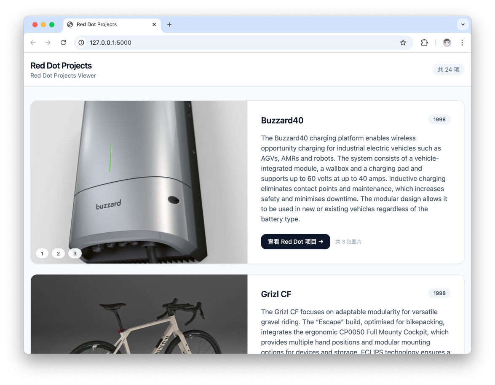

# 🎯 Red Dot Award Projects Crawler & Viewer

一个 **Red Dot Award（红点设计奖）项目爬取 + 本地浏览** 的完整工具链：

* ✅ 使用 **Selenium + Requests** 自动抓取 Red Dot 官网项目
* ✅ 自动解析 **标题 / 年份 / 分类 / 描述 / 项目图片**
* ✅ 图片自动下载并按项目分目录保存
* ✅ 支持 **搜索页缓存**，可增量更新
* ✅ 使用 **Flask** 提供本地 Web 页面进行项目浏览（支持多图切换）

---



## 📁 项目结构

```
red-dot/
├── app.py                 # Flask 本地浏览器
├── main.py                # Red Dot Award 爬虫主程序
├── README.md
└── data/
    ├── projects.json      # 所有项目的结构化数据
    ├── search_pages.json  # 搜索页缓存（避免重复 Selenium 抓取）
    ├── Bone Crate/
    │   ├── image_1.jpg
    │   └── ...
    ├── Buzzard40/
    └── ...
```

---

## ⚙️ 环境准备

### 1️⃣ Python 环境（建议 Conda）

```bash
conda create -n red-dot python=3.9
conda activate red-dot
```

### 2️⃣ 安装依赖

```bash
pip install flask requests beautifulsoup4 lxml tqdm selenium webdriver-manager
```

> ⚠️ **需要本机已安装 Chrome 浏览器**（Selenium 使用）

---

## 🕷️ 爬取 Red Dot 项目数据（main.py）

### 基本用法

```bash
python main.py
```

默认行为：

* 抓取 Red Dot 搜索结果前 **2 页**
* 并发抓取项目详情
* 自动下载项目图片
* 写入 `data/projects.json`

---

### 常用参数说明

```bash
python main.py \
  --max-pages 5 \
  --workers 8 \
  --headless
```

| 参数               | 说明                           |
| ---------------- | ---------------------------- |
| `--search-url`   | Red Dot 搜索页面 URL（不含 page 参数） |
| `--max-pages`    | 搜索页数量                        |
| `--page-wait`    | Selenium 打开搜索页后的等待时间         |
| `--workers`      | 并发抓取项目详情的线程数                 |
| `--detail-delay` | 每个项目抓取后的延时（防封）               |
| `--headless`     | 无头 Chrome                    |
| `--output-dir`   | 数据输出目录（默认 `data/`）           |

---

### 🔁 增量更新机制

* 已抓取的项目会记录在 `projects.json`
* 再次运行时：

  * **只更新新增项目**
  * 或 **Description 为空的项目**
* 搜索页使用 `search_pages.json` 缓存，避免重复 Selenium 访问

---

## 🖼️ 图片下载规则

* 每个项目一个独立文件夹（自动 sanitize）
* 图片命名格式：

```
image_1.jpg
image_2.png
...
```

* 自动根据 HTTP `Content-Type` 修正扩展名
* 已存在图片不会重复下载

---

## 🌐 本地 Web 浏览器（app.py）

### 启动方式

```bash
python app.py
```

或指定参数：

```bash
python app.py --port 8000 --title "Red Dot Design Projects"
```

浏览器访问：

```
http://127.0.0.1:5000
```

---

### Web 页面功能

* 📌 项目列表纵向展示
* 🖼️ 左侧图片浏览（支持多图切换）
* 📝 项目标题 / 年份 / 描述
* 🔗 跳转 Red Dot 官网项目页
* 📦 所有资源本地加载，无需联网

---

## 🧠 技术细节说明

### 爬虫部分

* 搜索页：**Selenium**
* 项目详情：**Requests + BeautifulSoup**
* 描述提取策略（高鲁棒）：

  1. `.project-description`
  2. `Statement by the Jury` 前的正文
  3. `main` 区域前两段正文
  4. meta / og description 兜底
* 图片提取：

  * slider 图片
  * 排除 `Others interested too` 之后的内容

---

## 🚀 适用场景

* 设计奖项研究 / 趋势分析
* 设计作品离线归档
* 内部展示 / 灵感库
* 作为爬虫 + Flask 项目的参考模板

---

## ⚠️ 注意事项

* Red Dot 官网结构如有变化，可能需要微调解析规则
* Selenium 抓取速度不要过快，避免 IP 风险
* 仅用于 **学习 / 研究 / 非商业用途**

---

## 📜 License

仅供学习与研究用途
Red Dot Award 相关内容版权归原网站所有